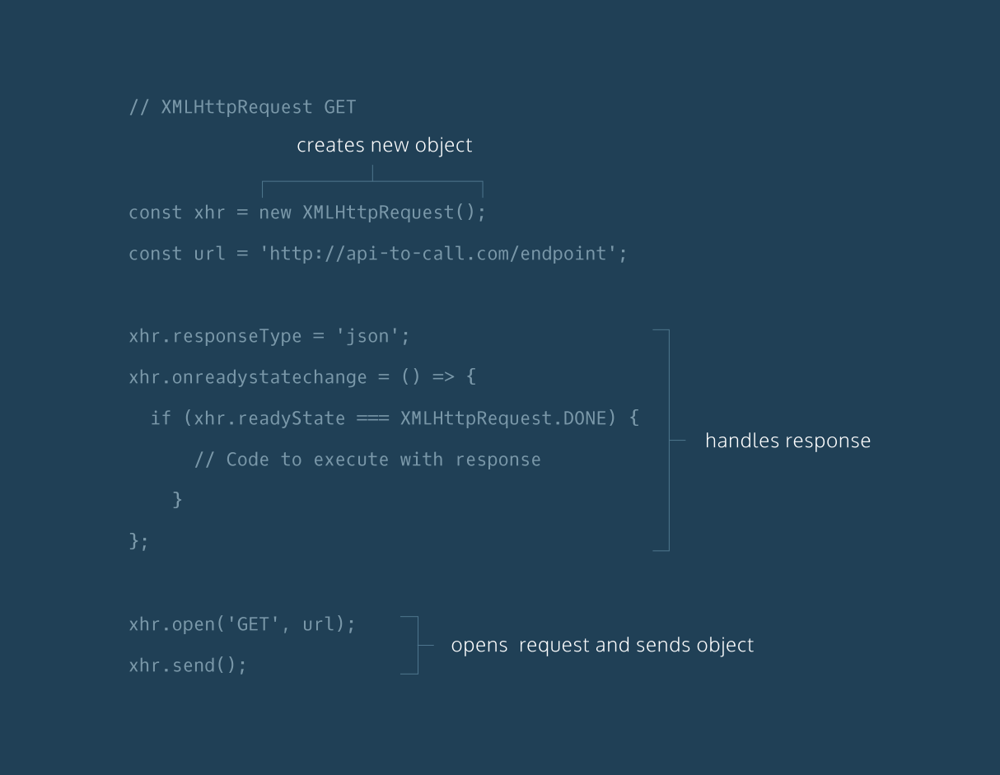
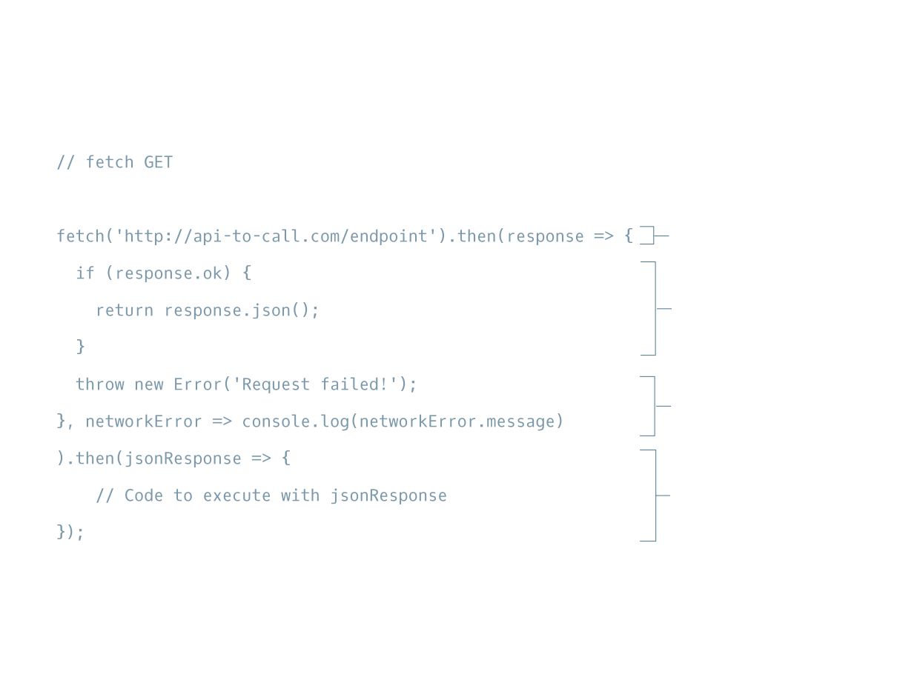
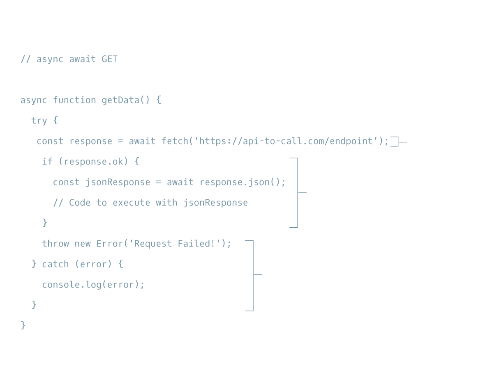
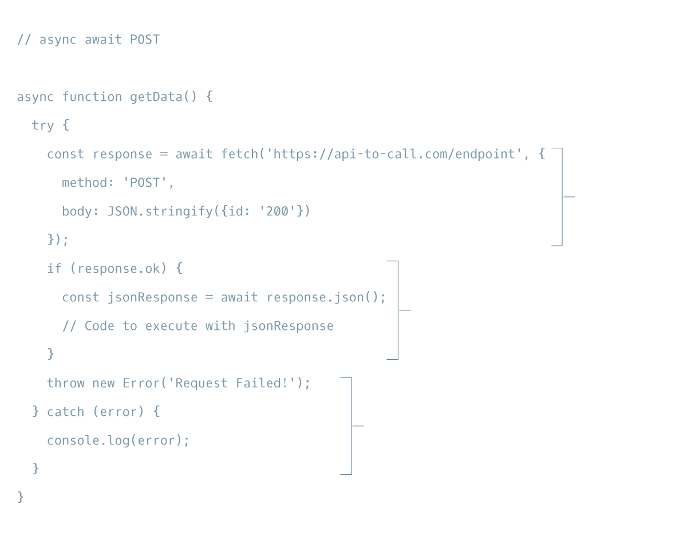

# Review Requests II

Let’s recap on the concepts covered in the previous exercises:

GET and POST requests can be created a variety of ways.

Use AJAX to asynchronously request data from APIs. fetch() and async/await are new functionalities developed in ES6
(promises) and ES8 respectively.

    - Promises are a new type of JavaScript object that represent data that will eventually be returned from a request.
    - fetch() is a web API that can be used to create requests. fetch() will return promises.
    - We can chain .then() methods to handle promises returned by fetch().
    - The .json() method converts a returned promise to a JSON object.
    - async is a keyword that is used to create functions that will return promises.
    - await is a keyword that is used to tell a program to continue moving through the message queue while a promise
    resolves.
    - await can only be used within functions declared with async.

## request with XMLHttpRequest

## post with XMLHttpRequest

## request with fetch ES6

## post with fetch ES6

## request with fetch ES8

## post with fetch ES8

